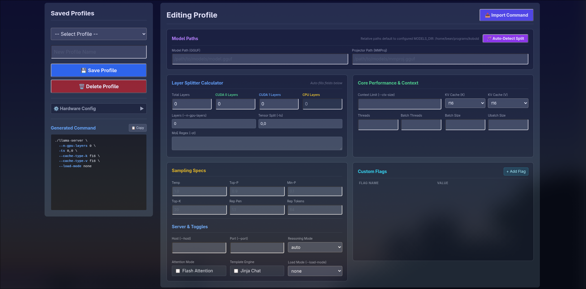

# Pascal's Power

*A specialized web-based management tool and launcher for llama.cpp, optimized for Mixture-of-Experts (MoE) offloading on mixed-generation NVIDIA GPU setups.*

## Overview

Pascal's Power allows you to leverage older NVIDIA hardware (like the Pascal-era GTX 10-series) to run modern, massive Mixture-of-Experts (MoE) models. Instead of letting overflow spill to the slow CPU/System RAM, it routes expert blocks to older cards while keeping compute-intensive attention layers on modern tensor-core GPUs. This methodology, **Architecture-Aware Routing**, turns deprecated hardware into useful inference capacity.

## Key Features

- **Auto-Split Calculator:** Automatically analyzes GGUF headers to compute optimal layer splits for your specific GPU configuration (dense and MoE models).
- **Profile Management:** Save, load, and export complex `llama-server` launch configurations.
- **Command Import:** Paste raw terminal commands; the tool parses flags and parameters into the GUI.
- **Live ANSI Logs:** Real-time server output with full color support for easier debugging.
- **Hardware Config:** Fine-tune VRAM allocation, display overhead, and safety buffers per GPU.
- **SSD-Safe Mode:** Automatically disables core dumps to protect drive longevity.
- **Standalone Capability:** Works as a full-featured `llama-server` management UI even on single-GPU systems.

## Screenshots



## The Methodology: Architecture-Aware Routing (ARR)

To maximize inference efficiency, Pascal's Power uses a strategic split between hardware generations based on what each layer type actually needs:

| Layer Type | Responsibility | Target Hardware |
| :--- | :--- | :--- |
| **Attention Layers** | Queries, Keys, Values, Output Projections | **Modern GPUs** (RTX 20+, Tensor Cores), which need compute bandwidth and fast VRAM |
| **Expert Blocks** | Sparse router + dense FFN per token | **Pascal/Older GPUs** (GTX 10-series+), which need VRAM capacity and do not care about fancy compute |
| **CPU Fallback** | Overflow when both GPUs are exhausted | System RAM |

This is achieved through `llama.cpp`'s `-ot` (expert routing) and `-ts` (tensor split) parameters. The auto-split calculator generates the correct pattern for your specific GPU configuration, eliminating the need for manual regex patterns.

For reference, here's what a typical `-ot` pattern looks like:

```bash
-ot "blk\.(0|1|2|3|4)\..*_exps\.=CUDA0,blk\.(5|6|7|8|9|10|11|12|13|14|15|16|17|18|19|20|21|22)\..*_exps\.=CUDA1,blk\.(23|24|25|26|27|28|29)\..*_exps\.=CPU"
```

This routes specific expert blocks to CUDA1 while ensuring all attention computation stays on the high-performance CUDA0.

## Requirements

- **Python:** 3.10+
- **llama.cpp:** A compiled `llama-server` binary available in your PATH or configured in `.env`.
- **Model Files:** GGUF format.
- **Optional Hardware:** Dual NVIDIA GPUs (e.g., RTX 30-series + GTX 10-series) for MoE offloading.

## Installation

```bash
# Clone the repository
git clone https://github.com/Yozam-87/pascals-power.git
cd pascals-power

# Set up a virtual environment
python -m venv .venv
source .venv/bin/activate  # Windows: .venv\Scripts\activate

# Install dependencies
pip install -r requirements.txt

# Configure environment
cp .env.example .env
# Edit .env to specify your LLAMA_SERVER_PATH if necessary
```

## Usage

To launch the web-based management interface:

```bash
python app.py
```

The interface will be available at `http://localhost:5005`.

### Quick Start

1. Configure your hardware in the **⚙️ Hardware Config** panel (GPU VRAM, overhead buffers)
2. Enter a model path or select from available GGUF files
3. Click **🪄 Auto-Detect Split** to calculate the optimal layer split
4. Launch with **▶ Launch** or copy the generated command

### Quick Example

Paste something like this into the GUI's command importer to get started:

```bash
llama-server -m ./models/<your-model>.gguf -ot "<your-routing-pattern>" -ts 1,0
```

Replace `<your-model>` with your GGUF file and `<your-routing-pattern>` with the `-ot` pattern from the Methodology section (or use the auto-split calculator to generate one for your GPUs).

## Hardware Compatibility

**Officially tested:**
- GPU 0: RTX 3050 (6GB)
- GPU 1: GTX 1070 (8GB)

**Should work (unverified):**
- Any Pascal-era card (GTX 1060, 1070, 1080, 1080 Ti, P40, etc.) paired with a modern tensor-core GPU (RTX 20/30/40 series)

The methodology relies on `llama.cpp`'s `-ot` and `-ts` parameters, which are hardware-agnostic. If your cards support the required CUDA features, it should work, but always verify with a small model first.

## Troubleshooting

| Issue | Likely Cause | Fix |
|-------|--------------|-----|
| `llama-server` not found | Binary not in PATH or `.env` not set | Set `LLAMA_SERVER_PATH` in `.env` or ensure it's on your PATH |
| Windows mixed-GPU setup ignores one card | Driver-level conflict | This is a known Windows limitation. Linux is strongly recommended for multi-GPU MoE setups |
| Pascal GPU not detected | CUDA 13 dropped Pascal support | Use CUDA 12.x toolchain |
| Poor performance with MoE model | Wrong `-ot` pattern or `-ts` mismatch | Use the auto-split calculator, or verify your pattern against the model's layer count |
| Server launches but UI shows no logs | ANSI log streaming not connected | Check browser console; may need to refresh the page after server starts |

## Security Note

The web interface binds to `localhost:5005` by default. If you change the bind address (e.g., to `0.0.0.0`), be aware there is no authentication, so anyone on the network can launch servers and view logs. Keep it local or add your own auth layer if exposing it.

## Support

If this project has been useful, consider [☕ buying me a coffee on Ko-fi](https://ko-fi.com/Yozam-87)!

## License

MIT - see [LICENSE](LICENSE)
